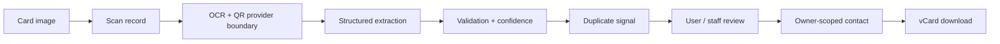

# CardIQ

CardIQ is a demo-ready business card intelligence workspace. It retains the full scan record, presents normalized contact fields with confidence, flags duplicates, produces vCards, and provides a staff-only central review surface.

## Run locally

```powershell
pip install -r requirements.txt
python manage.py migrate
python manage.py runserver 8000 --insecure
```

Visit `http://127.0.0.1:8000`. Create a normal account through the UI. The seeded staff account is `admin` / `cardiq-demo-2026`.

## Architecture



The Django `Scan` model preserves original file references, raw OCR, QR data, structured extraction, validation data, confidence, device/platform metadata, and status. `Contact` data is always queried by owner in user routes. Staff access is gated with `is_staff` and records access in `AuditLog`.

## Demo behavior and next steps

The scanner uses deterministic sample extraction so the project runs without paid API credentials. A production integration should replace `demo_payload()` with injectable OCR, QR, preprocessing, and LLM providers; move media to private object storage; use PostgreSQL; and add asynchronous processing, REST endpoints, and automated tests.
